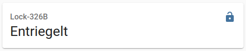
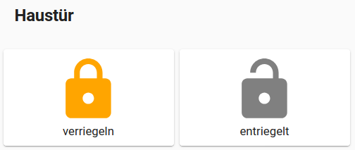

# tedee_lock
Homeassistant Custom Component

[**original thread**](https://community.home-assistant.io/t/custom-component-tedee-doorlock/242743)

This component is a continuation of @joerg65's great work on providing a [Home Assistant integration](https://github.com/joerg65/tedee_lock) for Tedee locks as well as the [pytedee lib](https://github.com/joerg65/pytedee). 
He stopped working on the component, so I started to make modifications of my own. To install this component, simply add this repository to HACS.

This plugin requires a Tedee bridge! 

Put this lines into the configuration:
```yaml
lock:
  - platform: tedee
    username: tedee-username
    password: tedee-password
```

After restart of Homeassistant you should see the lock:



Here is how I made a horizontal-stack with two custom button-cards:

```yaml
type: horizontal-stack
title: Haustür
cards:
  - entity: lock.haustuer
    type: custom:button-card
    size: 20%
    state:
      - value: locked
        color: gray
        icon: mdi:lock
        name: verriegelt
      - value: unlocked
        color: orange
        icon: mdi:lock
        name: verriegeln
    tap_action:
      action: call-service
      service: lock.lock
      service_data:
        entity_id: lock.haustuer
  - type: conditional
    conditions:
      - entity: lock.haustuer
        state: locked
    card:
      entity: lock.haustuer
      type: custom:button-card
      size: 20%
      color: gray
      icon: mdi:lock-open
      name: entriegeln
      tap_action:
        action: call-service
        service: lock.unlock
        service_data:
          entity_id: lock.haustuer
  - type: conditional
    conditions:
      - entity: lock.haustuer
        state: unlocked
    card:
      entity: lock.haustuer
      type: custom:button-card
      size: 20%
      color: gray
      icon: mdi:lock-open
      name: öffnen
      tap_action:
        action: call-service
        service: lock.open
        service_data:
          entity_id: lock.haustuer
```

